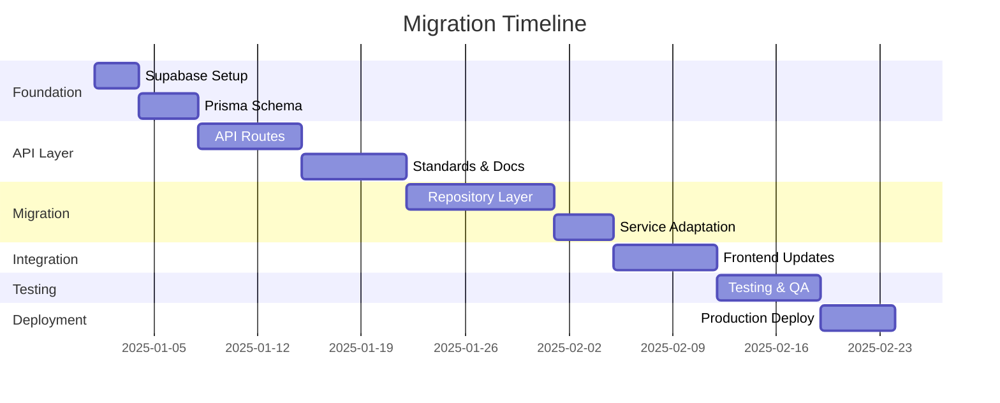

# SNM Analytics - Production Deployment Migration Plan

## Executive Summary

This document outlines the complete migration strategy for transforming SNM Analytics from a localStorage-based prototype to a production-ready application using:

- **Database**: Supabase (PostgreSQL)
- **ORM**: Prisma
- **API Layer**: Next.js API Routes
- **Authentication**: Supabase Auth
- **Deployment**: Vercel (recommended)

## Current State Analysis

### Existing Architecture
```
┌─────────────────────────────────────────┐
│         React Components                 │
├─────────────────────────────────────────┤
│         Service Layer                    │
├─────────────────────────────────────────┤
│       Repository Layer                   │
├─────────────────────────────────────────┤
│    LocalStorage Service                  │
├─────────────────────────────────────────┤
│    Browser LocalStorage                  │
└─────────────────────────────────────────┘
```

### Target Architecture
```
┌─────────────────────────────────────────┐
│         React Components                 │
├─────────────────────────────────────────┤
│      API Client Layer (NEW)              │
├─────────────────────────────────────────┤
│    Next.js API Routes (NEW)              │
├─────────────────────────────────────────┤
│         Service Layer                    │
├─────────────────────────────────────────┤
│    Prisma ORM (NEW)                      │
├─────────────────────────────────────────┤
│    Supabase PostgreSQL (NEW)             │
└─────────────────────────────────────────┘
```

## Migration Phases

### Phase 1: Foundation Setup (Week 1)
- [ ] Supabase project setup
- [ ] Prisma schema design
- [ ] Database migrations
- [ ] Environment configuration
- [ ] Authentication setup

### Phase 2: API Layer Development (Week 2-3)
- [ ] API route structure
- [ ] Request/response standards
- [ ] Error handling
- [ ] Validation middleware
- [ ] API documentation

### Phase 3: Repository Migration (Week 4-5)
- [ ] Prisma repository implementation
- [ ] Service layer adaptation
- [ ] Transaction management
- [ ] Data integrity checks

### Phase 4: Frontend Integration (Week 6)
- [ ] API client implementation
- [ ] Component updates
- [ ] State management
- [ ] Error handling UI

### Phase 5: Testing & Optimization (Week 7)
- [ ] Unit tests
- [ ] Integration tests
- [ ] Performance optimization
- [ ] Security audit

### Phase 6: Deployment (Week 8)
- [ ] Production environment setup
- [ ] Data migration scripts
- [ ] Deployment automation
- [ ] Monitoring setup

## Key Benefits

### Scalability
- Multi-user support
- Concurrent access
- Data consistency
- Real-time updates

### Security
- Row-level security (RLS)
- Encrypted connections
- Audit logging
- Role-based access control

### Performance
- Indexed queries
- Connection pooling
- Caching strategies
- Optimized queries

### Maintainability
- Type-safe database access
- Automated migrations
- Version control
- Rollback capabilities

## Risk Mitigation

### Data Loss Prevention
- Comprehensive backup strategy
- Migration validation scripts
- Rollback procedures
- Data integrity checks

### Downtime Minimization
- Parallel development
- Feature flags
- Gradual rollout
- Fallback mechanisms

### Performance Issues
- Load testing
- Query optimization
- Caching implementation
- CDN integration

## Success Criteria

1. **Functionality**: All existing features work identically
2. **Performance**: Response times < 200ms for 95% of requests
3. **Reliability**: 99.9% uptime
4. **Security**: Pass security audit
5. **Scalability**: Support 100+ concurrent users
6. **Data Integrity**: Zero data loss during migration

## Timeline



## Next Steps

1. Review and approve this migration plan
2. Set up development environment
3. Create detailed technical specifications
4. Begin Phase 1 implementation

## Documentation Structure

This plan is organized into the following documents:

1. **01-MIGRATION-OVERVIEW.md** (this file)
2. **02-DATABASE-SCHEMA.md** - Prisma schema design
3. **03-API-STANDARDS.md** - API design standards
4. **04-API-ROUTES.md** - Complete API route specifications
5. **05-REPOSITORY-LAYER.md** - Prisma repository implementation
6. **06-AUTHENTICATION.md** - Auth strategy
7. **07-DEPLOYMENT.md** - Deployment guide
8. **08-TESTING-STRATEGY.md** - Testing approach
9. **09-MIGRATION-SCRIPTS.md** - Data migration
10. **10-ROLLBACK-PLAN.md** - Emergency procedures

---

**Status**: Planning Phase  
**Last Updated**: January 2025  
**Owner**: Development Team
